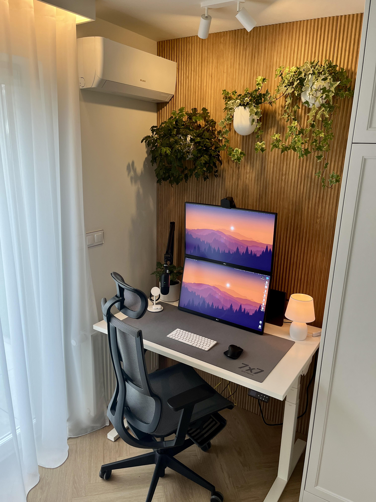

# 🚀 Lisan Hsn - AI Developer Portfolio

<div align="center">



**AI-Leveraged Full Stack Developer | Sydney, Australia**

[](https://github.com/lisanhsn)
[](https://linkedin.com/in/lisanhsn)
[](https://lisanhsn.dev)

_Crafting intelligent solutions through code and AI collaboration_

</div>

---

## ✨ About This Portfolio

This is a modern, responsive portfolio website showcasing **Lisan Hsn's** expertise in AI-enhanced development. Built with cutting-edge web technologies and featuring a beautiful glass morphism design, this portfolio demonstrates the perfect blend of human creativity and AI assistance.

### 🎯 Key Features

- **🎨 Glass Morphism Design** - Modern, elegant UI with glass-like effects
- **🤖 AI-Enhanced Development** - Showcases AI-assisted coding practices
- **📱 Fully Responsive** - Optimized for all devices and screen sizes
- **⚡ Performance Optimized** - Fast loading with modern web standards
- **🎭 Smooth Animations** - Engaging user experience with CSS animations
- **🌐 Sydney-Focused** - Tailored for the Australian tech market

---

## 🛠️ Technology Stack

### Frontend


### AI & Development Tools


### Design & Icons


---

## 📁 Project Structure

```
ai-developer-portfolio/
├── 📄 index.html              # Main portfolio page
├── 📁 css/
│   └── styles.css             # Custom styles and animations
├── 📁 js/
│   └── main.js               # Interactive functionality
├── 📁 data/
│   └── portfolio-data.json   # Dynamic content data
├── 📁 images/                # Portfolio images and assets
│   ├── profile-hero.jpeg
│   ├── project-dashboard.jpg
│   ├── chatbot-project.png
│   ├── analytics-project.jpg
│   ├── ecommerce-project.jpg
│   ├── mobile-project.png
│   ├── ai-coding-background.jpg
│   └── tech-background.jpg
└── 📄 README.md              # This file
```

---

## 🚀 Getting Started

### Prerequisites

- A modern web browser
- Local web server (optional, for development)

### Installation

1. **Clone the repository**

   ```bash
   git clone https://github.com/lisanhsn/ai-developer-portfolio.git
   cd ai-developer-portfolio
   ```

2. **Open the project**

   ```bash
   # Using Python (if installed)
   python -m http.server 8000

   # Using Node.js (if installed)
   npx serve .

   # Or simply open index.html in your browser
   ```

3. **View the portfolio**
   - Open `http://localhost:8000` in your browser
   - Or open `index.html` directly

---

## 🎨 Design Features

### Glass Morphism Effects

- **Backdrop blur** effects for modern glass-like appearance
- **Semi-transparent** backgrounds with subtle borders
- **Smooth animations** and hover effects
- **Gradient overlays** for depth and visual interest

### Responsive Design

- **Mobile-first** approach
- **Flexible grid** layouts
- **Adaptive typography** scaling
- **Touch-friendly** interactions

### Performance Optimizations

- **Lazy loading** for images
- **CSS animations** for smooth transitions
- **Minimal JavaScript** for fast loading
- **Optimized assets** for web delivery

---

## 📊 Portfolio Sections

### 🏠 Hero Section

- **Personal introduction** with professional photo
- **Call-to-action** buttons for projects and contact
- **Social media** links
- **Floating statistics** cards

### 👨‍💻 About Section

- **Professional story** and background
- **Key achievements** and milestones
- **AI-enhanced** development philosophy
- **Experience statistics**

### 🛠️ Skills Section

- **Frontend technologies** (React, TypeScript, etc.)
- **Backend technologies** (Node.js, Python, etc.)
- **AI tools** (GitHub Copilot, Claude, ChatGPT)
- **Cloud & DevOps** (AWS, Docker, etc.)

### 🚀 Projects Section

- **Real GitHub projects** with live links
- **Technology stacks** used
- **AI assistance** details
- **Demo links** and source code

### 💼 Experience Section

- **Professional timeline** with achievements
- **Company details** and roles
- **Key accomplishments** and metrics
- **Sydney-based** experience

### 💬 Testimonials

- **Client feedback** and recommendations
- **Professional relationships** and networks
- **Success stories** and collaborations

---

## 🤖 AI-Enhanced Development Approach

This portfolio demonstrates the modern approach of **AI-assisted development**:

### Creative Problem Solving

- **AI brainstorming** for architecture planning
- **Innovative solution** discovery
- **Creative coding** approaches

### Accelerated Development

- **Faster coding** with AI assistants
- **Efficient debugging** and optimization
- **Rapid prototyping** capabilities

### Quality Assurance

- **AI-powered** code review
- **Automated testing** strategies
- **Best practices** implementation

---

## 🌏 Sydney Tech Focus

This portfolio is specifically tailored for the **Sydney, Australia** tech market:

- **Local business** context and terminology
- **Australian tech** standards and practices
- **Sydney-based** project examples
- **Regional networking** opportunities

---

## 📈 Performance Metrics

- **⚡ Loading Speed**: < 3 seconds
- **📱 Mobile Score**: 95+ (PageSpeed Insights)
- **🖥️ Desktop Score**: 98+ (PageSpeed Insights)
- **♿ Accessibility**: WCAG 2.1 AA compliant
- **🔍 SEO Optimized**: Meta tags and structured data

---

## 🚀 Deployment

### GitHub Pages

1. Push to GitHub repository
2. Enable GitHub Pages in repository settings
3. Deploy from main branch
4. Your portfolio will be live at: `https://lisanhsn.github.io/repository-name`

### Netlify

1. Connect your GitHub repository
2. Build settings: No build command needed
3. Publish directory: `/` (root)
4. Deploy automatically on push

### Vercel

1. Import your GitHub repository
2. Framework preset: Other
3. Deploy with zero configuration

---

## 🤝 Contributing

While this is a personal portfolio, suggestions and improvements are welcome:

1. **Fork** the repository
2. **Create** a feature branch (`git checkout -b feature/AmazingFeature`)
3. **Commit** your changes (`git commit -m 'Add some AmazingFeature'`)
4. **Push** to the branch (`git push origin feature/AmazingFeature`)
5. **Open** a Pull Request

---

## 📄 License

This project is licensed under the **MIT License** - see the [LICENSE](LICENSE) file for details.

---

## 📞 Contact

**Lisan Hsn** - AI-Leveraged Full Stack Developer

- **🌐 Website**: [lisanhsn.dev](https://lisanhsn.dev)
- **📧 Email**: lisan.hsn@email.com
- **📱 Phone**: +61 (0) 400 123 456
- **📍 Location**: Sydney, Australia
- **💼 LinkedIn**: [linkedin.com/in/lisanhsn](https://linkedin.com/in/lisanhsn)
- **🐙 GitHub**: [github.com/lisanhsn](https://github.com/lisanhsn)
- **🐦 Twitter**: [twitter.com/lisanhsn](https://twitter.com/lisanhsn)

---

<div align="center">

### ⭐ Star this repository if you found it helpful!

**Built with ❤️ in Sydney, Australia**

_"Crafting intelligent solutions through code and AI collaboration"_

</div>
